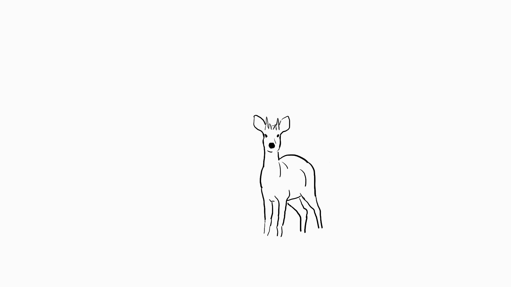

# Creatings
# 作品集
[portfolio for game design application](Portfolio_Zihan_Liu.pdf)


## 写作
Twine制作的简单互动小说 [短吻鳄](alligator.html)

短篇小说 [闯进屋子的男人](man.md)

剧本 [早泄男孩难以讲述的故事](boy.md)

三则短故事 [短故事](story.md)

短篇小说 [撒尿](pee.md)

小说 [独臂导师（部份）](mentor.md)

## 游戏
可以翻转世界的解谜小游戏（用puzzlescript制作的demo，目前只有几关）

## 动画


我转描了一个动物“一步一步”逃走的小动画，这是我第一次尝试画动画（还会不断更新）。这个物种是 _Tetracerus quadricornis_ （四角羚），它具有非常独特的四只角。


## 游戏策划

这一年我开始记录自己想到的简短的关于游戏设计的点子，大多数只是一个想法还没有完整构想：

### 吃线条的貘


对于类似这种线稿素描的图，当图里的线条密度ρ=0时，一张图的空白的，ρ=1时就是现在图片的效果，那如果在图片的不同区域等比抽取图片中的线条，或者说随机从图片中抽取一定比例的线条，ρ=0.5，图片展示出的信息就是完全不一样的。这构成了一种可互动的改变场景信息的方式，并且可以保留线稿素描/速写的强烈的美术风格。

我设想一个完全由线条构成的世界，一个生物（比如貘）可以吃掉线条也可以吐出线条，以此改变场景的阴影、物品的结构，揭示更多的信息或者隐藏的通路。以这个作为核心方式的游戏。
（一个地方拥有更多的线条就会变得更黑，隐藏了更多的信息，就必须吸掉；太少的线条又无法表现出信息，必须要把线条吐在那里。）（每一个场景中都有线条的池，比如墨水瓶是正池、阳光是负池。）（貘在吸入线条之后角色会有变化，比如变胖，或者身上的线条变密集）

比方说有一个房子，大门、不同房间的门对于貘来说是难以直接通过的，所以利用吞吐线条的方式进行移动，和房屋里的成员（人+猫猫狗狗电子生物）进行互动。貘的目的是吃掉他们的噩梦，吃掉噩梦里的线条，然后把噩梦变成好梦。家庭成员的梦和故事在此互相关联。


### 躲避二手烟

在室内躲避二手烟的游戏，逃往空间里唯一安全无烟的吸烟室吧！

在地图上会有缓慢的血条减少，靠近抽烟的人时血条会减少更快，要在短暂的时间内找到出路。

欺骗性的出口：室外的门，厕所。

路上的障碍：人，行李箱，扫地机。跑酷越过障碍（？）。

结局：最后跑到吸烟室之后，经历一个短暂的平静，立刻进来一个抽烟的人。


### 文字小人格斗
（显然已经有人做出来了！）
在一本书里，地图全是各种各样的文字。小人跨过字组成的山和水，打败其它名字的敌人，打败作品中引用的其它名著里的人，最后遇到了作者的手（？
需要一个基础的冒险故事，以文本形式出现，做为线性的地图，但也可以从故事的结尾开始，甚至可以扮演恶龙

呈现：
时间轴和舞台剧---鬼魂上，鬼魂下
走在句子上---勇者遇到了一条河--河变成流动的“水”字：
```

              水水水水
              水水石水
勇者     “平原上流躺着一条宽阔的河 ”          
              水水水水
              水水水水
              
```
